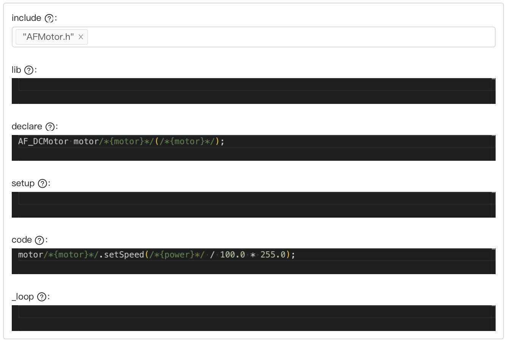

# mBlock for Raspberry Pi

These scripts build a version of the [mBlock](https://mblock.cc/pages/downloads) programming environment for the Raspberry Pi (arm64 Linux).

## Installing mBlock on a Raspberry Pi

1. Navigate to the [releases](https://github.com/jwbonner/mBlockRaspberryPi/releases/latest) page.
2. Download the 3 files attached to the release:
   - `mblock_X.X.X_arm64.deb`: mBlock package
   - `arduino_uno.mext`: Offline version of Arduino Uno extension
   - `olenepal_arduino.mext`: Extension for YAK robot control
3. On the Raspberry Pi, run `sudo apt install ./mblock_X.X.X_arm64.deb`.
4. Open the mBlock application (find it under the "Programming" category).
   - Note that mBlock may take 30+ seconds to start when launching for the first time (subsequent launches will be faster).
5. Drag the `arduino_uno.mext` and `olenepal_arduino.mext` files from a file browser to the mBlock window.
   - This step is only required once. After the initial install, add the "Arduino Uno" device using the panel on the left and click the "Extension" button to activate the OLE Nepal extension.

## Editing the mBlock Extension

mBlock extensions are a flexible way to add support for new devices and blocks. Each extension is packaged into a `.mext` file and can be installed by dragging the file to the window of the mBlock application. Two extensions are attached on the [releases](https://github.com/jwbonner/mBlockRaspberryPi/releases/latest) page of this project:

- `arduino_uno.mext` is an offline version of the Arduino Uno extension for mBlock. This extension was not created by us but we created a `.mext` file so that it can be installed without using the standard extension browser in mBlock (which requires an internet connection).
- `olenepal_arduino.mext` is a custom extension that includes the blocks required to control the YAK robotics kit. This extension can be expanded in the future to support new hardware configurations, as described below.

**All extensions are edited through the [mBlock Developer Platform](https://ext.mblock.cc/#/exts/device).**

### Importing an Extension

To open a `.mext` file in the mBlock Developer Platform, follow the steps below:

1. Navigate to the developer platform using the link above.
2. Sign in with an mBlock account. This account can be created for free through the [sign up](https://ext.mblock.cc/#/login/register) page.
3. Navigate to "My Plugin" > "My Extension" > "Import Data" and select the `.mext` file.
4. Click "OLE Nepal (Arduino)" in the list of extensions.

> [!TIP]
> After importing the `.mext` file, the extension will be saved in the web interface and can be edited multiple times without reimporting.

### Editing an Extension

#### Blocks

Configuring new blocks uses a graphical interface in the browser. For more information on how to configure new categories and blocks, check the documentation page [here](https://support.makeblock.com/hc/en-us/articles/15235802242199-Configuration-Configure-Blocks).

For the Arduino platform, each block includes several snippets of C code to be inserted when using the block. This code runs in the same environment as the Arduino IDE. The syntax `/*{PARAMETER}*/` can be used to refer to the parameters configured for the block. Hover over the "?" icon next to each code block for more details.

An example is shown below for the block that sets the speed of a DC motor. This code imports the `AFMotor.h` library, declares the motor object, and configured the speed (with the correct scaling) when the block is used.

> [!TIP]
> The mBlock documentation includes a simple example of creating a custom Arduino extension [here](https://support.makeblock.com/hc/en-us/articles/15235393507223-Example-Arduino-Create-an-LED-Extension-Using-the-Default-Arduino-Template), which explains how to configure a block for LED control with the corresponding C code.

#### Libraries

The "Add Source File" tab can be used to add header (`.h`) and implementation (`.cpp`) files which will be included when compiling the program. Library files can be freely removed or replaced on this tab to support additional hardware or define more complex functionality.

For example, the `AFMotor.h` and `AFMotor.cpp` libraries were downloaded from the [GitHub repository](https://github.com/adafruit/Adafruit-Motor-Shield-library) and added to the extension to support the Adafruit DC Motor Shield on the YAK robot. The `SmartServo.h` and `SmartServo.cpp` files are a custom library to support additional functionality on servo motors (such as modifying the speed).

#### Other Configuration

The "Advanced Configuration" tab can be used to configure the version, description, and supported platforms for the extension. When modifying the extension, **we recommend increasing the version number** to differentiate from previous releases.

### Exporting an Extension

After editing an extension, click the "Download" button to generate and download the `.mext` file that can be imported into the mBlock application. After importing the new version of the extension, **always close and reopen the mBlock application to apply the changes**.

## Building mBlock for Raspberry Pi

> [!NOTE]
> These instructions are only required to **create a new mBlock package** for installation on Raspberry Pis. Pre-built packages are available on the [releases](https://github.com/jwbonner/mBlockRaspberryPi/releases/latest) page.
>
> mBlock extensions can be also updated without rebuilding the mBlock package. See the [instructions](#editing-the-mblock-extension) on editing extensions for more details.

1. Install [Node.js](https://nodejs.org).
2. Clone this repository using [Git](https://git-scm.com/).
3. Navigate to the cloned repository and run `npm install`
4. Check the version of mBlock specified in `versions.json` and download the corresponding **Windows installer** from the [mBlock download page](https://mblock.cc/pages/downloads).
5. Place the installer in the root of the cloned repository. It should be named `VX.X.X.exe` (for example, the installer for mBlock 5.6.0 should be named `V5.6.0.exe`).
6. Run `npm run build` and wait for the process to complete. The correct version of Arduino will be downloaded automatically.
7. Find the complete Linux package under `dist/mblock_X.X.X_arm64.deb`.

To update mBlock or the Arduino version, simply change the version in `versions.json` and rebuild the Linux package using the instructions above. Note that non-trivial changes to mBlock may require additional changes to the build sequence. The full technical details of the build process can be found in the section below.

Technical Details

mBlock is built using [Electron](https://www.electronjs.org/), which packages a web interface (built with HTML, CSS, and JS) into a native application. The mBlock application is available on macOS (arm64 and x64) and Windows (x64), but the goal of this project is to create a version for Linux using the arm64 architecture. There are a few components to the mBlock application which must be accounted for when porting to Linux:

- **The Electron wrapper**, which uses Electron 21.4.4 as of mBlock 5.6.0. Electron has full support for Linux on arm64, so rebuilding the Electron wrapper for a new platform is trivial. The full configuration for this can be found in `package.json`.
- **The web app**, which is contained in an archive called `app.asar` in the resources folder of any Electron application. This format ([asar](https://www.npmjs.com/package/@electron/asar)) is similar to a `tar` archive and can be easily manipulated if necessary ([docs](https://www.npmjs.com/package/@electron/asar)). In our case, the _entire_ `app.asar` file can be copied directly from the original mBlock application to the new Linux application.
- **The Arduino toolchain**, which is a set of native tools for building on the AVR platform. This toolchain is contained in the resources folder of the mBlock application (all resources outside of `app.asar` are contained in a folder called `ml`). The native Arduino toolchain (e.g. for macOS or Windows) must be replaced by a version built for Linux. This toolchain is readily available for Linux on arm64 (it is packaged with the Arduino IDE, which is available for that platform).

**Build Sequence**

1. The `electron-builder` package is invoked to build the Electron wrapper. The full configuration, including the app icon and the file assocation for `.mblock` files are configured in `package.json`.
2. Before building the full application, the `beforePack.js` script is invoked to download and prepare all of the additional resources that will be incorporated into the final application. This scripts runs the following steps:
   1. Extract the mBlock installer provided before the build. This is a 7-zip file that will be extracted to the folder `build/mblock`. The resources folder for the original mBlock application is found under `build/mblock/resources`.
   2. Download and extract the Linux arm64 version of the Arduino IDE based on the version in `versions.json`. The contents of the Arduino IDE are found under `build/arduino/arduino-X.X.X` and the toolchain is found under `build/arduino/arduino-X.X.X/hardware/tools/avr`.
   3. Copy the `ml` resources folder from the mBlock application (`build/mblock/resources/ml`) to a temporary location (`build/ml`).
   4. Delete the Arduino toolchain that was packaged with mBlock from the temporary `ml` folder (`build/ml/v1/external/arduino/avr-toolchain`), since it's built for Windows and is not compatible with Linux arm64.
   5. Copy the Arduino toolchain from the Linux arm64 Arduino IDE (`build/arduino/arduino-X.X.X/hardware/tools/avr`) to the temporary `ml` folder (`build/ml/v1/external/arduino/avr-toolchain`).
   6. Recreate several symlinks in the new Linux toolchain. These symlinks are broken while downloading the copying the toolchain, so they are recreated using relative paths. The full list of symlinks can be found in `beforePack.js`.
3. The output of the `beforePack.js` script are the two key resources that must be incorporated into the final Electron application:
   - The `app.asar` archive, which will be copied directly from the extracted mBlock application (`build/mblock/resources/app.asar`).
   - The `ml` resources folder, which was modified with a Linux-compatible Arduino toolchain and is available under `build/ml`.
4. The Electron build configuration includes the list of "extra" resources to copy directly to the resources folder in the new application. These are specified under `package.json` > `build` > `extraResources`. The two resources described above are included in this list and copied directly to the final application.
5. The Electron build process requires an entrypoint script that is part of the `app.asar` archive. This is specified as `packages/main/dist/index.cjs` under `package.json` > `main` based on the configuration of the original mBlock application.
6. The rest of the Electron build proceeds as normal, producing a `.deb` package under `dist/mblock_X.X.X_arm64.deb`.

